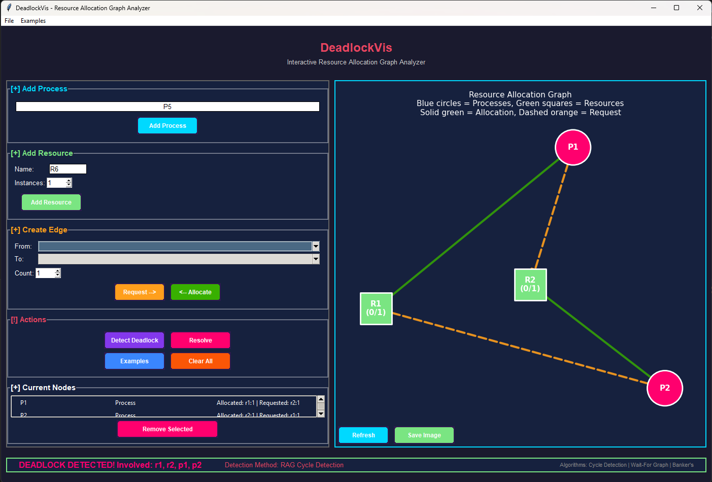

# 🔴 DeadlockVis — Visualize Deadlocks, Master Operating Systems

<p align="center">
  
  
  
  
</p>

<p align="center">
  <b>DeadlockVis is a Python desktop application for visualizing Operating System deadlocks using Resource Allocation Graphs. It lets users create processes and resources, connect allocation/request edges, detect deadlocks, and test simple resolution strategies through an interactive GUI.</b>
</p>


---

## 🎬 Demo Video

> 🎥 **[Watch the 4-minute Demo](your-video-link-here)** — See DeadlockVis in action!

 

---

## Project Overview

The goal of this project is to make deadlock concepts easier to understand than static textbook diagrams. Users can build a graph, run detection, and immediately see whether the system is safe or deadlocked.

**Main capabilities:**

- Create processes and resources visually
- Add allocation edges and request edges
- Detect deadlocks in Resource Allocation Graphs
- Highlight deadlocked processes
- Resolve deadlocks by terminating processes or preempting resources
- Save/load scenarios and export graph visualizations

## Algorithms Used

| Algorithm | Purpose |
| --- | --- |
| Cycle Detection | Detects deadlock in single-instance Resource Allocation Graphs |
| Wait-For Graph | Converts resource dependencies into process dependencies |
| Banker's Algorithm | Checks whether the system is in a safe state |

## Quick Start

```bash
git clone https://github.com/yourusername/deadlockvis.git
cd deadlockvis
pip install -r requirements.txt
python main.py
```

Requires Python 3.10 or higher.

## How It Works

1. Add processes such as `P1`, `P2`.
2. Add resources such as `R1`, `R2`.
3. Create allocation edges from resources to processes.
4. Create request edges from processes to resources.
5. Click deadlock detection to analyze the graph.
6. Deadlocked processes are highlighted and can be resolved from the GUI.

Example deadlock:

```text
R1 -> P1, P1 -> R2
R2 -> P2, P2 -> R1
```

This creates a circular wait, so the system detects a deadlock.

## Tech Stack

| Area | Technology |
| --- | --- |
| Language | Python 3.10+ |
| GUI | Tkinter / CustomTkinter |
| Graph Algorithms | NetworkX |
| Visualization | Matplotlib |
| Data Storage | JSON |

## Project Structure

```text
deadlockvis/
+-- main.py              # Application entry point
+-- gui.py               # GUI implementation
+-- graph.py             # Deadlock algorithms and graph logic
+-- requirements.txt     # Dependencies
+-- examples/            # Saved scenarios
```

## Course Information

| | |
| --- | --- |
| Course | CSE323 - Operating System Design |
| Institution | North South University |
| Semester | Spring 2026 |
| Project Type | Educational OS Visualization Tool |
